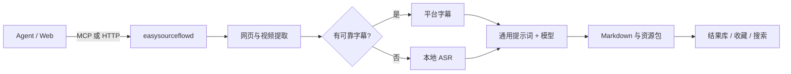

# EasySourceFlow

把长文和长视频交给 Agent，先看总结，再决定要不要看完。

无论是在飞书、微信还是其他通讯工具中，只需把网页、公众号文章、视频链接或文件发给你的 Agent。Agent 会调用 EasySourceFlow 提取内容、生成结构化总结，并把结果直接发回当前对话，帮你快速判断内容是否值得深入阅读或观看。

[快速开始](#快速开始) · [Agent 接入](#agent-接入) · [支持的来源](#支持的来源) · [隐私与安全](#隐私与安全) · [完整文档](#完整文档)


[](CHANGELOG.md)


## 为什么需要 EasySourceFlow？

Agent 很擅长调用工具，但不应该各自重复实现网页抓取、字幕判断、音频转写、提示词管理和文件写入。EasySourceFlow 把这些流程收敛到一个可恢复、可检查的本地服务中。

- **一次接入，多 Agent 共用**：Codex、OpenClaw 和其他 MCP 客户端调用同一套工具。
- **结果由服务直接交付**：Agent 原样返回最终 Markdown，不做二次总结或转写。
- **优先使用可靠来源**：视频优先平台字幕，缺失时才进入本地 ASR，并在结果中标明来源。
- **任务不会因短暂断线消失**：SQLite 持久化任务、缓存、重试和恢复状态。
- **数据留在本机**：服务默认只监听 `127.0.0.1`，输出、数据库和凭据都由用户本地管理。

## 主要能力

- Web 控制台提交链接或本地文件，查看任务、结果、收藏和全文搜索。
- Bilibili 字幕提取、登录态导入、本地 ASR 回退和资源包输出。
- 微信公众号与普通网页正文提取，支持浏览器兜底。
- OpenAI-compatible 模型接入，预置常见服务商、Fast/Pro 模型和独立凭据。
- 所有云端模型共用一份可在 Web 编辑的总结规则与 Markdown 模板。
- 视频自动使用 Pro，并生成与核心要点一一对应的可点击时间轴。
- 结果收藏会一并复制 Markdown、原始字幕、转写和来源元数据。
- 缓存感知模型、提示词和流水线版本，支持强制重新处理。
- 本地备份、日志轮转、清理预览和 macOS LaunchAgent 自启动。

## 支持的来源

| 来源 | 处理方式 | 备注 |
| --- | --- | --- |
| 普通网页 | 正文与元数据提取 | 新闻、教程、博客等 |
| 微信公众号 | 正文节点、懒加载图片、浏览器兜底 | 仅处理可访问页面 |
| Bilibili | 平台字幕优先，本地 ASR 回退 | 支持扫码登录态导入 |
| YouTube | 字幕提取与本地 ASR 回退 | 当前仍属于实验能力 |
| 本地文件 | PDF、DOCX、EPUB、TXT、Markdown、字幕、HTML | 内容由浏览器或 Agent 提交 |

## 快速开始

### 环境要求

- Python 3.9 或更高版本
- macOS 为当前主要支持平台
- 视频处理建议安装 `ffmpeg`、`yt-dlp` 和至少一种 Whisper 后端
- 使用云端总结时，需要一个 OpenAI-compatible 模型 API Key

### 安装

```bash
git clone <repository-url> EasySourceFlow
cd EasySourceFlow

python3 -m venv .venv
.venv/bin/pip install -e ".[dev]"
cp .env.example .env
```

启动服务并打开控制台：

```bash
scripts/easysourceflow start
scripts/easysourceflow open
```

默认地址为 [http://127.0.0.1:8765/](http://127.0.0.1:8765/)。首次使用建议在“维护”中依次完成模型配置、通用总结提示词和 Agent 接入检查。

常用命令：

```bash
scripts/easysourceflow status
scripts/easysourceflow health
scripts/easysourceflow restart
scripts/easysourceflow logs
scripts/easysourceflow regression
```

### macOS 开机自启动

```bash
scripts/easysourceflow install-launchd
scripts/easysourceflow launchd-status
```

运行副本默认位于 `~/.local/share/easysourceflow/launchd`，避免后台进程直接依赖用户文档目录中的源码。

## Agent 接入

MCP 客户端以 stdio 方式启动适配器：

```json
{
  "mcpServers": {
    "easysourceflow": {
      "command": "<PROJECT_ROOT>/.venv/bin/easysourceflow-mcp",
      "env": {
        "EASYSOURCEFLOW_BASE_URL": "http://127.0.0.1:8765"
      }
    }
  }
}
```

真实项目路径只应写入本机 Agent 配置，不要提交到 Git。安装官方 Skill：

```bash
scripts/easysourceflow install-skill "$AGENT_WORKSPACE"
```

Skill 会要求 Agent：

1. 使用异步任务提交链接并持续查询同一个 `job_id`。
2. 将 `result.summary_markdown` 原样交付，不做二次总结。
3. 视频默认使用 Pro，并保留字幕或 ASR 来源标记。
4. 用户回复“收藏”时收藏最近一次成功结果。

完整工具契约见 [Agent 接入指南](docs/AGENT_INTEGRATION.md) 和 [MCP API](docs/MCP_API.md)。

## 工作原理



底层提取、转写、模型调用和文件写入都由服务完成，Agent 只负责选择工具并交付结果。

## 输出与收藏

成功任务会写入 `EASYSOURCEFLOW_OUTPUT_DIR`。视频资源包通常包含：

- `summary.md`
- `metadata.json` 与来源信息
- 平台字幕或本地转写
- 带时间戳的完整文本
- 核心要点时间轴

Web 结果页会渲染 Markdown，并提供目录、复制、下载和收藏操作。收藏会复制完整资源包，同时阻止重复收藏。

## 通用总结提示词

Web 控制台中的提示词对 DeepSeek、OpenAI、Qwen、Kimi、GLM 以及其他兼容服务统一生效。默认模板包括：

- 只依据来源内容，不补充外部事实
- 字幕与转写完整性检查
- 一句话结论、核心要点、详细笔记和可引用摘录
- 行动项、沉淀建议、推荐标签与质量检查

标题、作者、提取方式、字幕状态、来源类型要求和正文由程序自动附加。更改提示词后，新任务不会错误复用旧缓存。本地抽取式兜底不调用模型，因此不使用该提示词。

## 隐私与安全

- API Key、Cookie 和本机路径只放在被 Git 忽略的 `.env` 或本地配置中。
- Agent 配置不需要持有模型 API Key。
- 通知和日志不包含来源正文、完整字幕、Cookie 或密钥。
- 本地文件通过内容上传，不允许服务端任意读取路径。
- 清理默认只做 dry-run，确认后才执行删除。
- CI 会运行测试、Ruff 和带脱敏输出的 Gitleaks 历史扫描。

公开发布前请执行 [GitHub 发布检查清单](docs/RELEASE_CHECKLIST.md)。安全问题请参阅 [SECURITY.md](SECURITY.md)。

## 开发与验证

```bash
PYTHONPATH=src .venv/bin/python -m compileall -q src tests
PYTHONPATH=src .venv/bin/python -m unittest discover -s tests -v
.venv/bin/ruff check src tests
scripts/easysourceflow regression
```

测试覆盖提取、字幕选择、ASR 质量、任务恢复、缓存、输出、HTTP、MCP、Web 交互和敏感信息防护。

## 已知限制

- 当前主要针对 macOS 本地运行和 launchd 部署。
- YouTube 字幕访问可能需要 Cookie 或额外的 yt-dlp 配置。
- 本地 ASR 的速度与质量取决于所选后端和模型。
- 当前不提供 Obsidian 自动写入、NotebookLM、RAG 或向量数据库。

## 完整文档

- [版本更新记录](CHANGELOG.md)
- [配置说明](docs/CONFIGURATION.md)
- [Agent 接入指南](docs/AGENT_INTEGRATION.md)
- [MCP API](docs/MCP_API.md)
- [架构设计](docs/ARCHITECTURE.md)
- [部署说明](docs/DEPLOYMENT.md)
- [运行手册](docs/OPERATIONS.md)
- [安全与隐私](docs/SECURITY_PRIVACY.md)
- [测试计划](docs/TEST_PLAN.md)
- [路线图](docs/ROADMAP.md)

## 贡献与许可证

欢迎通过 Issue 和 Pull Request 提交问题与改进。请先阅读 [贡献指南](CONTRIBUTING.md)。

EasySourceFlow 使用 [MIT License](LICENSE)。
