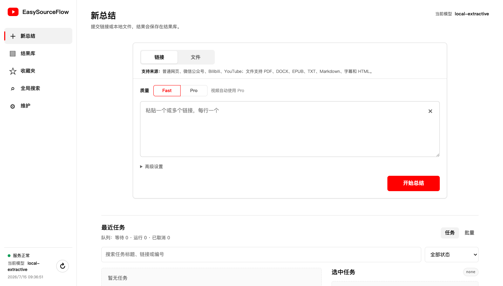
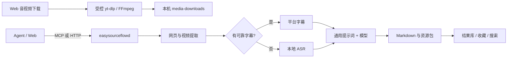

# EasySourceFlow

把长文和视频交给 Agent，先看总结，再决定要不要看完。

无论是在飞书、微信还是其他通讯工具中，只需把网页、公众号文章、视频链接或文件发给你的 Agent。Agent 会调用 EasySourceFlow 提取内容、生成结构化总结，并把结果直接发回当前对话，帮你快速判断内容是否值得深入阅读或观看。

> **此外：** 本地服务还支持下载 B站或 YouTube 内容，可选择下载完整视频，也可以只下载音频。

[快速开始](#快速开始) · [Agent 接入](#agent-接入) · [支持的来源](#支持的来源) · [隐私与安全](#隐私与安全) · [完整文档](#完整文档)


[](CHANGELOG.md)




## 为什么需要 EasySourceFlow？

Agent 很擅长调用工具，但不应该各自重复实现网页抓取、字幕判断、音频转写、提示词管理和文件写入。EasySourceFlow 把这些流程收敛到一个可恢复、可检查的本地服务中。

- **一次接入，多 Agent 共用**：Codex、OpenClaw 和其他 MCP 客户端调用同一套工具。
- **结果由服务直接交付**：Agent 原样返回最终 Markdown，不做二次总结或转写。
- **优先使用可靠来源**：视频优先平台字幕，缺失时才进入本地 ASR，并在结果中标明来源。
- **任务不会因短暂断线消失**：SQLite 持久化任务、缓存、重试和恢复状态。
- **数据留在本机**：服务默认只监听 `127.0.0.1`，输出、数据库和凭据都由用户本地管理。

## 主要能力

- Web 控制台提交链接或本地文件，查看任务、结果、收藏和全文搜索。
- Web 控制台单独下载 Bilibili/YouTube 视频或音频，支持进度、取消、重试和本机文件交付；该能力不向 Agent 开放。
- Bilibili 字幕提取、扫码后自动接入登录态、本地 ASR 回退和资源包输出。
- YouTube 登录后自动接入 Chrome 登录态、人工/自动字幕优先级、本地 ASR 回退和可诊断错误。
- 微信公众号与普通网页正文提取，支持浏览器兜底。
- 模型接入预置 DeepSeek、OpenAI、通义千问、Kimi、智谱、MiniMax、Gemini、硅基流动、xAI、豆包、百度千帆、腾讯混元和 OpenRouter。
- 支持 Ollama、LM Studio 本地模型；模型 ID 可选预设，也可按服务商实际可用模型直接输入。
- 所有云端模型共用一份可在 Web 编辑的总结规则与 Markdown 模板。
- 视频自动使用 Pro，并生成与核心要点一一对应的可点击时间轴。
- 结果收藏会一并复制 Markdown、原始字幕、转写和来源元数据。
- 缓存感知模型、提示词和流水线版本，支持强制重新处理。
- 本地备份、日志轮转、清理预览和 macOS LaunchAgent 自启动。

## 支持的来源

| 来源 | 处理方式 | 备注 |
| --- | --- | --- |
| 普通网页 | 正文与元数据提取 | 新闻、教程、博客等 |
| 微信公众号 | 正文节点、懒加载图片、浏览器兜底 | 仅处理可访问页面 |
| Bilibili | 平台字幕优先，本地 ASR 回退 | 扫码后自动接入登录态 |
| YouTube | 人工字幕优先、原语言自动字幕次之、本地 ASR 回退 | 登录后自动接入 Chrome 登录态 |
| 本地文件 | PDF、DOCX、EPUB、TXT、Markdown、字幕、HTML | 内容由浏览器或 Agent 提交 |

## 快速开始

### 环境要求

- Python 3.10 或更高版本
- macOS 为当前主要支持平台
- Google Chrome，用于 Bilibili 扫码、YouTube 登录和受限网页兜底
- 视频处理建议安装 `ffmpeg` 和至少一种 Whisper 后端；`yt-dlp` 会随 Python 包安装
- YouTube 处理需要 Deno 2.3+（推荐）或 Node.js 22+，安装会同时带上匹配的 `yt-dlp-ejs`
- 使用云端总结时，需要对应服务商的模型 API Key；Ollama 和默认未启用鉴权的 LM Studio 不需要 Key

### 安装

在当前 GitHub 仓库页面点击 **Code → HTTPS**，复制仓库地址，然后把下面的 `REPOSITORY_HTTPS_URL` 替换为该地址：

```bash
git clone REPOSITORY_HTTPS_URL EasySourceFlow
cd EasySourceFlow

python3 -m venv .venv
.venv/bin/python -m pip install --upgrade pip
.venv/bin/python -m pip install -e ".[browser]"
cp .env.example .env
```

启动服务并打开控制台：

```bash
scripts/easysourceflow start
scripts/easysourceflow open
```

默认地址为 [http://127.0.0.1:8765/](http://127.0.0.1:8765/)。运行 `scripts/easysourceflow status` 看到服务地址后，即表示本地服务已经启动。

### 首次配置

打开 Web 控制台后，按以下顺序完成配置：

1. 进入“维护 → 模型”，选择服务商和模型，填写 API Key，先点“测试连接”，成功后设为当前模型。本地 Ollama/LM Studio 可按实际鉴权要求留空 Key。
2. 如果使用 Clash、Surge、Mihomo 等代理，先按下方“Fake-IP 代理”说明检查网络；不要直接关闭本地 URL 防护。
3. 处理 Bilibili 或 YouTube 前，进入“维护 → 账号与授权”完成扫码或登录。仅处理普通公开网页时可以跳过。
4. 按需进入“维护 → 提示词”调整通用总结模板，进入“维护 → Agent 接入”复制 MCP 配置并安装 Skill。
5. 查看左下角状态：绿色“已就绪”表示全部检查正常；黄色可能只是 Bilibili/YouTube 尚未登录，不影响公开网页，红色需要点击并按引导处理。

完成后回到“新总结”，先提交一个公开网页链接验证模型和输出，再测试需要登录或本地 ASR 的视频。

### Fake-IP 代理

部分代理会把公网域名解析到 `198.18.0.0/15`，严格 URL 校验会将其当作非公网地址拒绝。请用 EasySourceFlow 的 Python 环境检查实际解析结果：

```bash
.venv/bin/python -c "import socket; print(sorted({item[4][0] for item in socket.getaddrinfo('www.bilibili.com', 443)}))"
```

如果结果包含 `198.18.x.x` 或 `198.19.x.x`：

1. 打开“维护 → 网络与安全”。
2. 开启“信任下列 Fake-IP 网段”。
3. 保留默认的 `198.18.0.0/15`，点击“保存网络设置”；Web 保存后立即生效，无需重启。

如果代理明确使用其他 Fake-IP 地址池，只添加代理配置中真实使用的 CIDR。不要把真实公司内网、家庭局域网、loopback 或 link-local 网段加入信任清单，也不要用 `EASYSOURCEFLOW_ALLOW_LOCAL_URLS=true` 代替 Fake-IP 配置。

也可以手工修改 `.env`，但修改后必须重启：

```ini
EASYSOURCEFLOW_TRUST_FAKE_IP=true
EASYSOURCEFLOW_FAKE_IP_CIDRS=198.18.0.0/15
```

```bash
scripts/easysourceflow restart
```

处理 B站或 YouTube 前，进入“维护 → 账号与授权”点击对应登录按钮。扫码或登录完成后，EasySourceFlow 会自动检测并接入 Chrome 登录态；只有检测失败或五分钟超时时才显示“手动重试”。已接入时可以点“退出登录”解除本工具的授权，不会退出 Chrome 中的账号。接入后，YouTube 任务直接读取所选 Chrome 配置档的当前登录态，避免普通浏览器 Cookie 被轮换后继续使用失效快照；本地过滤文件仅用于状态检查和兼容兜底。

需要保存音视频时，打开侧边栏“音视频下载”，粘贴单个 Bilibili 或 YouTube 链接，选择视频清晰度或音频格式。下载文件保存在 `EASYSOURCEFLOW_DATA_DIR/media-downloads/`，不会写入总结结果库，也不会作为 MCP/Agent 工具暴露。

### 常见问题

| 现象 | 处理方式 |
| --- | --- |
| 启动后网页打不开 | 运行 `scripts/easysourceflow status`，再用 `scripts/easysourceflow logs` 查看启动错误。 |
| `invalid_url` 且提示 `198.18.0.0/15` | 按上方 Fake-IP 步骤在“维护 → 网络与安全”开启可信网段。 |
| 模型测试失败 | 在“维护 → 模型”确认服务商、模型 ID、API Key、余额和 API 地址，再重新测试。 |
| Bilibili/YouTube 提示需要 Cookie | 在“维护 → 账号与授权”重新登录，确认当前 Chrome 账号能打开原视频。 |
| 缺少 `ffmpeg`、Whisper 或其他依赖 | 运行 `scripts/easysourceflow health` 查看具体缺项，并参考[部署说明](docs/DEPLOYMENT.md)。 |

常用命令：

```bash
scripts/easysourceflow status
scripts/easysourceflow health
scripts/easysourceflow restart
scripts/easysourceflow logs
scripts/easysourceflow regression
scripts/easysourceflow youtube-regression --force-refresh
```

### macOS 开机自启动

```bash
scripts/easysourceflow install-launchd
scripts/easysourceflow launchd-status
```

运行副本默认位于 `~/.local/share/easysourceflow/launchd`，避免后台进程直接依赖用户文档目录中的源码。

## Agent 接入

MCP 客户端以 stdio 方式启动适配器：

```json
{
  "mcpServers": {
    "easysourceflow": {
      "command": "<PROJECT_ROOT>/.venv/bin/easysourceflow-mcp",
      "env": {
        "EASYSOURCEFLOW_BASE_URL": "http://127.0.0.1:8765"
      }
    }
  }
}
```

真实项目路径只应写入本机 Agent 配置，不要提交到 Git。安装官方 Skill：

```bash
scripts/easysourceflow install-skill "$AGENT_WORKSPACE"
```

Skill 会要求 Agent：

1. 使用异步任务提交链接并持续查询同一个 `job_id`。
2. 将 `result.summary_markdown` 原样交付，不做二次总结。
3. 视频默认使用 Pro，并保留字幕或 ASR 来源标记。
4. 用户回复“收藏”时收藏最近一次成功结果。

音视频下载是本机 Web 专用功能，不在 MCP 工具清单中，Agent 不能触发下载。

完整工具契约见 [Agent 接入指南](docs/AGENT_INTEGRATION.md) 和 [MCP API](docs/MCP_API.md)。

## 工作原理



底层提取、转写、模型调用和文件写入都由服务完成，Agent 只负责选择工具并交付结果。

## 输出与收藏

成功任务会写入 `EASYSOURCEFLOW_OUTPUT_DIR`。视频资源包通常包含：

- `summary.md`
- `metadata.json` 与来源信息
- 平台字幕或本地转写
- 带时间戳的完整文本
- 核心要点时间轴

Web 结果页会渲染 Markdown，并提供目录、复制、下载和收藏操作。收藏会复制完整资源包，同时阻止重复收藏。

## 通用总结提示词

Web 控制台中的提示词对所有已配置模型服务统一生效。默认模板包括：

- 只依据来源内容，不补充外部事实
- 字幕与转写完整性检查
- 一句话结论、核心要点、详细笔记和可引用摘录
- 行动项、沉淀建议、推荐标签与质量检查

标题、作者、提取方式、字幕状态、来源类型要求和正文由程序自动附加。更改提示词后，新任务不会错误复用旧缓存。本地抽取式兜底不调用模型，因此不使用该提示词。

## 隐私与安全

- API Key、Cookie 和本机路径只放在被 Git 忽略的 `.env` 或本地配置中。
- Agent 配置不需要持有模型 API Key。
- 通知和日志不包含来源正文、完整字幕、Cookie 或密钥。
- 本地文件通过内容上传，不允许服务端任意读取路径。
- 清理默认只做 dry-run，确认后才执行删除。
- CI 会运行测试、Ruff 和带脱敏输出的 Gitleaks 历史扫描。

公开发布前请执行 [GitHub 发布检查清单](docs/RELEASE_CHECKLIST.md)。安全问题请参阅 [SECURITY.md](SECURITY.md)。

## 开发与验证

```bash
PYTHONPATH=src .venv/bin/python -m compileall -q src tests
PYTHONPATH=src .venv/bin/python -m unittest discover -s tests -v
.venv/bin/ruff check src tests
scripts/easysourceflow regression
```

测试覆盖提取、YouTube/Bilibili 字幕选择、ASR 质量、任务恢复、缓存、输出、HTTP、MCP、Web 交互和敏感信息防护。真实平台回归不会进入普通 CI。

## 已知限制

- 当前主要针对 macOS 本地运行和 launchd 部署。
- YouTube 仍可能按视频、账号或客户端要求 Cookie、PO Token 或更新版 `yt-dlp`；EasySourceFlow 不绕过平台权限。
- 音视频下载只处理单个 Bilibili/YouTube 链接，不处理播放列表、DRM、付费或无权保存的内容。
- 本地 ASR 的速度与质量取决于所选后端和模型。
- 当前不提供 Obsidian 自动写入、NotebookLM、RAG 或向量数据库。

## 完整文档

- [版本更新记录](CHANGELOG.md)
- [配置说明](docs/CONFIGURATION.md)
- [Agent 接入指南](docs/AGENT_INTEGRATION.md)
- [MCP API](docs/MCP_API.md)
- [架构设计](docs/ARCHITECTURE.md)
- [部署说明](docs/DEPLOYMENT.md)
- [运行手册](docs/OPERATIONS.md)
- [安全与隐私](docs/SECURITY_PRIVACY.md)
- [测试计划](docs/TEST_PLAN.md)
- [YouTube 真实回归样例](docs/YOUTUBE_REGRESSION_SAMPLES.md)
- [路线图](docs/ROADMAP.md)

## 贡献与许可证

欢迎通过 Issue 和 Pull Request 提交问题与改进。请先阅读 [贡献指南](CONTRIBUTING.md)。

EasySourceFlow 使用 [MIT License](LICENSE)。
