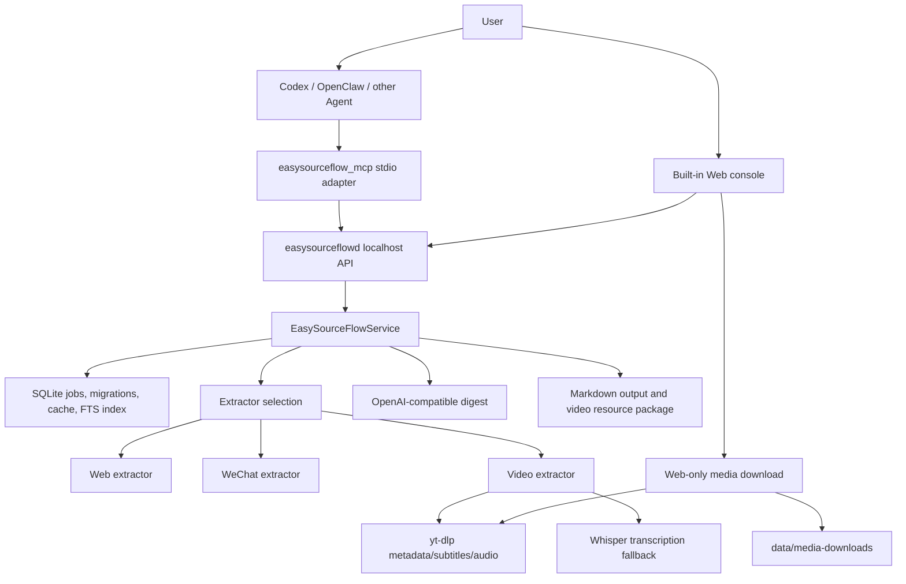

# 架构设计

## 1. 架构目标

- 给 Agent 一个简单、稳定、可发现的工具接口。
- 把网页抓取、视频处理、转写、总结和文件输出封装在本地服务内部。
- 长任务不依赖某一个 Agent 会话一直在线。
- 所有输出先落到本地 Markdown 文件。
- 后续可以增加新来源、新模型、新输出目标。

当前阶段不包含 Obsidian writer。Obsidian 是后续输出目标，不是当前架构组件。

## 2. 总体架构



## 3. 组件

### 3.1 Agent

Agent 负责理解用户自然语言，并决定调用哪个 MCP 工具。Agent 不直接处理网页抓取、视频下载、转写、文件路径等底层细节。

这里的“视频下载”不包含 Web 专用媒体保存功能。MCP 不暴露下载工具，Agent 不能创建或列出 `media_download` 任务。

### 3.2 `easysourceflow_mcp`

MCP 适配器，面向 Agent 暴露工具。它只负责：

- MCP 初始化和工具发现。
- 把工具调用转成 HTTP 请求。
- 把服务返回结果格式化为 Agent 可读文本或 JSON。
- 把服务连接失败转换成可读错误。

当前使用 stdio transport，便于本机 Agent 接入。

### 3.3 `easysourceflowd`

本地 HTTP 服务，默认监听 `127.0.0.1:8765`。它负责：

- 创建单链接任务。
- 创建批量任务。
- 查询任务和批量状态。
- 调用提取器、总结器和输出写入器。
- 运行健康检查。
- 清理旧输出和临时文件。
- 为本机 Web 创建、查询和交付受控音视频下载任务。

### 3.4 Extractors

按来源选择提取器：

- 普通网页: 本地 HTTP 抓取、正文抽取、OpenGraph / JSON-LD / metadata 辅助。
- 微信公众号: 专用 DOM 和脚本变量提取，支持懒加载图片和 Playwright / Chrome 兜底。
- B 站: `yt-dlp` 元数据、平台字幕接口、cookies 文件、音频转写兜底。
- YouTube: `yt-dlp` 元数据、Chrome 实时登录态、人工/自动字幕优先级、本地 ASR 兜底和平台错误分类。

### 3.5 Transcription fallback

当视频没有可用字幕时，服务可以下载音频并转写。

当前配置支持：

- `whisper_cpp`
- `mlx_whisper`
- `faster_whisper`

已验证可用后端是 `whisper_cpp`。

### 3.6 Summarization engine

总结器把提取文本、用户指令、来源元数据组合成模型输入。主路径使用 OpenAI-compatible Chat Completions；豆包按当前官方接口使用 Responses API。Web 预置 DeepSeek、OpenAI、通义千问、Kimi、智谱、MiniMax、Gemini、硅基流动、Ollama、LM Studio、xAI、豆包、百度千帆、腾讯混元和 OpenRouter。模型适配层只提取最终答案：MiniMax 请求独立返回推理内容，Chat Completions 的 `reasoning_content`、`reasoning_details`、`reasoning` 与 Responses API 的 reasoning 项均不进入结果；输出清洗还会拒绝未闭合的推理标签和提示词回显。云端服务缺少 API Key 时走本地抽取式摘要兜底；回环地址上的 Ollama 和 LM Studio 可在无 Key 时调用。

### 3.7 SQLite store

保存：

- 单链接任务。
- 批量任务。
- 规范化 URL。
- 总结结果。
- 结果缓存。
- 错误信息。
- 可恢复请求参数和强制刷新标记。
- 输出文档增量索引；运行环境不支持 FTS5 时回退到普通索引查询。
- Web 音视频下载任务及其受控选项；普通任务列表和 MCP 列表会过滤该类型。

数据库使用 `PRAGMA user_version` 逐版本迁移。启动时，可重放的 `queued` / `running` 任务会恢复到队列；缺少持久化输入的旧任务才会标记为 `interrupted`。

结果缓存键包含规范化输入、指令、质量档位、模型 provider/model 和总结流水线版本，并受 `EASYSOURCEFLOW_CACHE_TTL_SECONDS` 限制。强制刷新会完全跳过缓存读取。

### 3.8 Output writer

负责写入 Markdown 和视频资源包。

普通任务输出：

```text
var/output/YYYY-MM-DD/<source_type>/<time-title>.md
```

视频任务额外输出资源包目录，包含元数据、字幕、转写文本和 `summary.md`。

## 4. 数据流

### 4.1 同步总结

```text
Agent calls easysourceflow_summarize_link
  -> MCP POST /summarize
  -> service extracts content
  -> service summarizes content
  -> service writes Markdown
  -> result is returned to Agent
```

仅用于兼容需要同步返回的短网页调用方。B 站和 YouTube 会在 MCP 层被拒绝并提示使用异步工具；Agent 的新链接请求不默认走这条路径。

### 4.2 异步任务

```text
Agent calls easysourceflow_submit_link
  -> MCP POST /jobs
  -> service returns job_id
Agent calls easysourceflow_get_job
  -> MCP GET /jobs/{job_id}
  -> service returns status, progress, and final result
```

这是 Agent 处理任意单个链接的默认路径。`get_job` 可在一次调用内等待最多 45 秒；如果任务仍在排队或运行，Agent 保留同一 `job_id` 并再次查询，不把等待状态当成失败，也不生成替代总结。

### 4.3 批量任务

```text
Agent calls easysourceflow_submit_batch
  -> MCP POST /batches
  -> service creates one job per URL
Agent calls easysourceflow_get_batch
  -> MCP GET /batches/{batch_id}
  -> service returns counts and per-job summary
```

### 4.4 Web 音视频下载

```text
Web POST /downloads
  -> service creates media_download job
  -> yt-dlp downloads one Bilibili/YouTube item
  -> FFmpeg optionally merges or converts
  -> GET /downloads/{job_id}/file returns an attachment
```

文件只写入 `EASYSOURCEFLOW_DATA_DIR/media-downloads/<job_id>/`。服务校验最终路径仍在该根目录内；MCP 没有对应工具。

## 5. 内部数据模型

### 5.1 `SourceDocument`

```json
{
  "source_url": "https://example.com/article",
  "canonical_url": "https://example.com/article",
  "source_type": "web",
  "title": "Article title",
  "author": "Author name",
  "published_at": "2026-06-28T12:00:00Z",
  "language": "zh",
  "content_text": "Extracted text",
  "content_markdown": "# Extracted markdown",
  "metadata": {},
  "extraction_method": "web_html_metadata"
}
```

### 5.2 `SummaryResult`

```json
{
  "title": "Suggested title",
  "summary_markdown": "...",
  "tags": ["summary", "source/web"],
  "suggested_note_path": "web/example.md",
  "save_recommendation": {
    "should_save": false,
    "reason": "Current stage writes local Markdown only."
  },
  "source": {}
}
```

任务成功后会在结果里追加：

```json
{
  "output_markdown_path": "~/.local/share/easysourceflow/output/...",
  "resource_package_path": "~/.local/share/easysourceflow/output/..."
}
```

## 6. 状态机

任务状态：

- `queued`
- `running`
- `succeeded`
- `failed`

常见阶段：

- `received`
- `extracting`
- `transcribing`
- `summarizing`
- `writing_output`
- `done`
- `failed`

## 7. 关键约束

- MCP 工具数量保持少而稳定。
- Agent 不直接调用 `yt-dlp`、`ffmpeg`、Playwright 或文件写入。
- 外部命令使用参数数组，不拼接 shell 字符串。
- cookies 只读，不写入日志或响应。
- 默认阻止本地和内网 URL，避免 SSRF。
- 清理工具默认 dry-run。

## 8. 扩展点

- 新来源提取器。
- 新转写后端。
- 新模型 provider。
- 新输出目标，例如 Obsidian。
- 状态网页面板。
